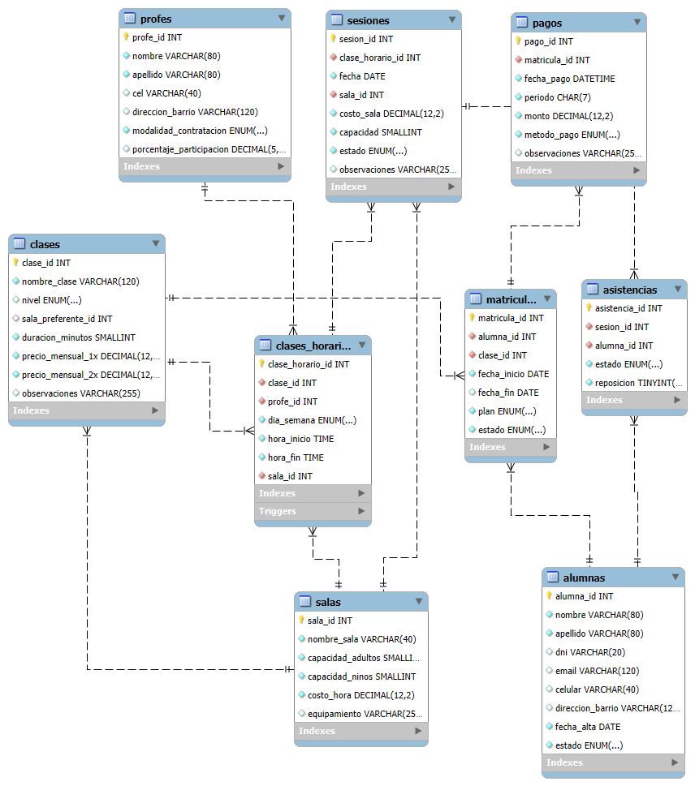

# Aydee Dance Studio DB 🩰📊

Modelo relacional completo, datos de muestra y entorno Docker list-and-go para gestionar clases, horarios, matrículas y pagos de un estudio de danzas.


## 1 · Descripción

Este proyecto surge de la necesidad de **organizar académica y administrativamente** un estudio con varias disciplinas, múltiples docentes y distintos planes de matrícula (1×, 2× y combo de 2 disciplinas).  
Incluye:

* **Esquema relacional** con integridad referencial completa  
* Sesiones generadas automáticamente vía _stored procedure_  
* Datos de ejemplo para pruebas rápidas  
* Stack Docker (MySQL 8 + Adminer) listo para levantar en un comando

<p align="center">
  
</p>

## 2 · Levantar en local

```bash
git clone https://github.com/<tu_usuario>/aydee-dance-studio-db.git
cd aydee-dance-studio-db
docker compose up -d
